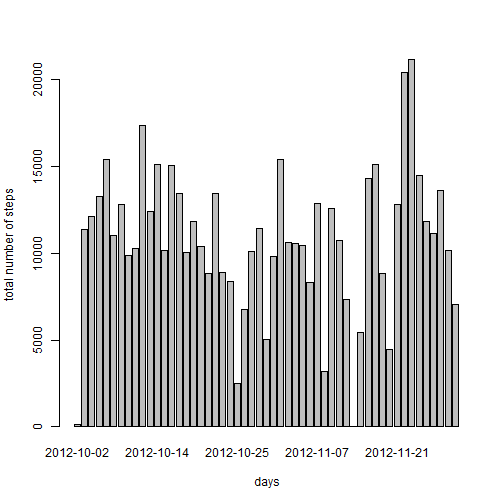
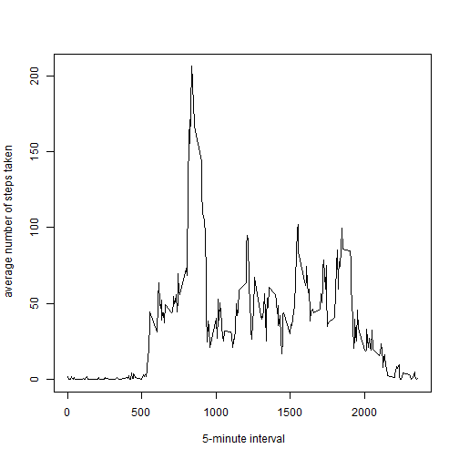
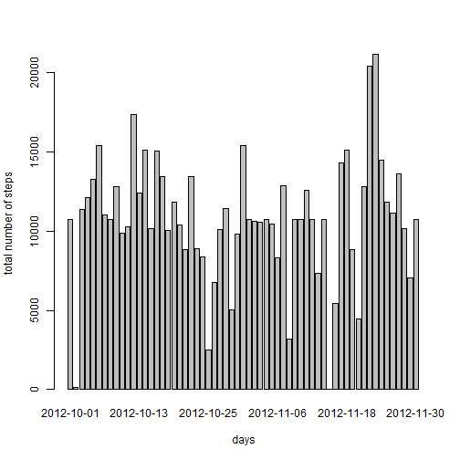
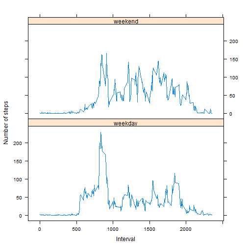

Reproducible Research - Peer Assessment 1
========================================================

Loading and preprocessing the data


```r
library(data.table)
## Assume data file under the default folder
df <- read.csv("activity.csv", colClasses = c("numeric", "character", "numeric"))
df[, 2] <- as.Date(df[, 2], "%Y-%m-%d")
```


What is mean total number of steps taken per day?


```r
df1 <- df[!(is.na(df$steps)), ]
DT <- data.table(df1)
dtA <- DT[, sum(steps), by = date]
## The two columes are 'date' 'V1'
dfA <- as.data.frame(dtA)
```


What is mean total number of steps taken per day?

1. Histogram of the total number of steps taken each day

```r
barplot(dfA$V1, names.arg = dfA$date, ylab = "total number of steps", xlab = " days")
```

 


2.1 - Mean total number of steps taken per day

```r
x <- dfA[, 2]
mean(x)
```

```
## [1] 10766
```

 
2.2 - Median total number of steps taken per day

```r
x <- dfA[, 2]
median(x)
```

```
## [1] 10765
```


What is the average daily activity pattern?

1.  a time series plot (i.e. type = "l") of the 5-minute interval (x-axis) and the average number of steps taken, averaged across all days (y-axis)

```r
dtB <- DT[, mean(steps), by = interval]
dfB <- as.data.frame(dtB)
plot(dfB$interval, dfB$V1, type = "l", ylab = " average number of steps taken", 
    xlab = " 5-minute interval")
```

 


2.  Which 5-minute interval, on average across all the days in the dataset, contains the maximum number of steps?


```r
dfB[which(dfB[, 2] == max(dfB[, 2])), 1]
```

```
## [1] 835
```


Imputing missing values

1.  the total number of missing values in the dataset

```r
dfna <- df[(is.na(df$steps)), ]
nrow(dfna)
```

```
## [1] 2304
```


2. The strategy for filling in all of the missing values in the dataset, is to use the mean value from the above for each interval

```r
dfc <- merge(dfna, dfB, by.x = "interval", by.y = "interval", all = FALSE)
dfc[, 2] <- dfc[, 4]
dfc[, 4] <- NULL
dfc1 <- dfc[, c(2, 3, 1)]
```


3.  Create a new dataset that is equal to the original dataset but with the missing data filled in.

```r
dfc2 <- rbind(df1, dfc1)
dfc3 <- dfc2[order(dfc2$date, dfc2$interval, decreasing = FALSE), ]
```


4.1  Make a histogram of the total number of steps taken each day 

```r
DT3 <- data.table(dfc3)
dtc4 <- DT3[, sum(steps), by = date]
## 'date' 'V1' 'newcol'
dfc4 <- as.data.frame(dtc4)
barplot(dfc4$V1, names.arg = dfc4$date, ylab = "total number of steps", xlab = " days")
```

 


4.2  the mean and median total number of steps taken per day. 

```r
y <- dfc4[, 2]
mean(y)
```

```
## [1] 10766
```

```r
median(y)
```

```
## [1] 10766
```


Do these values differ from the estimates from the first part of the assignment? 
Not much in mean, and a bit in median

What is the impact of imputing missing data on the estimates of the total daily number of steps?
Inaccurate Results

Are there differences in activity patterns between weekdays and weekends?
1.  Create a new factor variable in the dataset with two levels – “weekday” and “weekend” indicating whether a given date is a weekday or weekend day.


```r
dfc3$newcol <- weekdays(dfc3[, 2])
dfc3$myweekday <- apply(dfc3, 1, function(row) {
    a <- ""
    if (row[4] == "Saturday") {
        a <- "weekend"
    } else if (row[4] == "Sunday") {
        a <- "weekend"
    } else {
        a <- "weekday"
    }
    a
})
DT4 <- data.table(dfc3)
DT4a <- DT4[, mean(steps), by = list(myweekday, interval)]
dfd <- as.data.frame(DT4a)
dfd <- transform(dfd, myweekday = factor(myweekday))
```


Make a panel plot containing a time series plot 

```r
# 'myweekday' 'interval' 'V1'
library("lattice")
xyplot(V1 ~ interval | myweekday, data = dfd, type = "l", xlab = "Interval", 
    ylab = "Number of steps", layout = c(1, 2))
```

 


Yes, it is different
